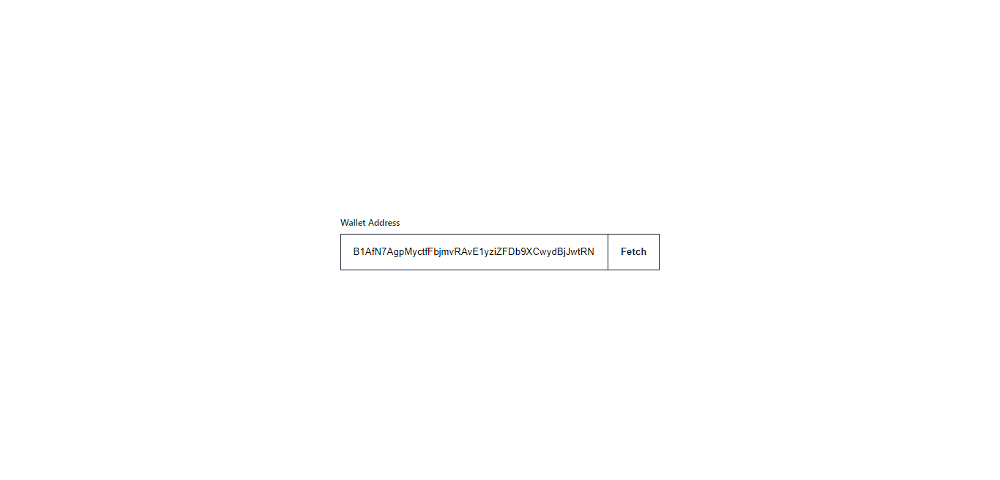
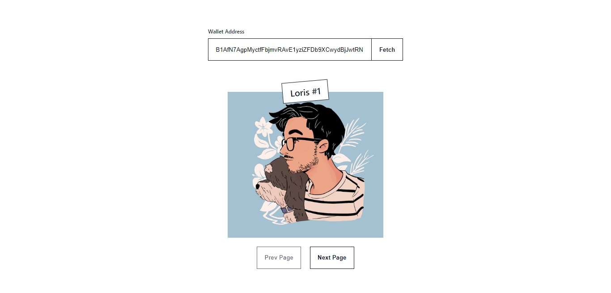

# **Paginating NFTs**

An app made during Solana Campus Connect Workshop.  
Simple app which makes it easy to view NFTs owned by any wallet in a paginated manner on the Solana Blockchain.  

**Website :**
- [Link](https://paginatenft.vercel.app/)
- [Mirror IPFS Link](https://spheron.infura-ipfs.io/ipfs/QmaTVqtBnkbXJeQShFMmK5BVNdnpjVyg7XitdUkSJM1xSi)
#
**Screenshots:**  
Landing Screen
  

Fetched NFTs (First Page)  

